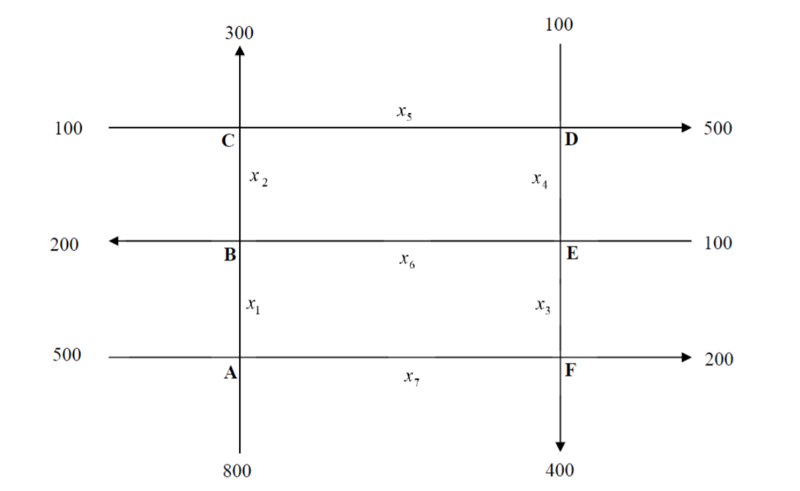

<center></center>

<center><h2><b>Proyecto 01<h2></b></center>

<h4><b>Estudiante:</b> Merian Herrera Fuentes <br></h4>

```{r echo=FALSE, message=FALSE}
library("pracma")
library("mosaic")
library("MASS")
```

<br>
<div style="background-color:#1D2951;color:white;padding:3px;marging:10px;">
  <h4><b>&nbsp;&nbsp;&nbsp;I Parte</b></h4>
</div>
<br>

<div style="text-align: justify;">
<b>
[6 puntos] En una tienda especializada en la preparación de mezclas de café para conocedores, el dueño desea preparar bolsas de un kilogramo para venderlas a $3.5 usando las variedades de café colombiano, brasileño y de Kenia. El costo por kilogramo de cada uno de estos tres tipos de café es respectivamente $4, $2 y $3.
<br> <br>
a) Muestre que se debe usar al menos $\frac{1}{2}$ kg de café colombiano y a lo sumo  y al menos  $\frac{1}{4}$ kg de café brasileño.
<br>
b) Determine la cantidad de cada tipo de café suponiendo que el dueño decide usar $\frac{1}{8}$ de café brasileño.
</b>
</div>

```{r}
matriz <- matrix(c(
  1, 1, 1, 0, 0, 0, 1,
  0, 0, 0, 1, 1, 1, 3.5
), nrow = 2, ncol = 7, byrow = TRUE
)

fractions(pracma::rref(matriz))
```


<br>
<div style="background-color:#1D2951;color:white;padding:3px;marging:10px;">
  <h4><b>&nbsp;&nbsp;&nbsp;II Parte</b></h4>
</div>
<br>

<div style="text-align: justify;">
<b>
[10 puntos] Imagine que en un sector determinado de una ciudad, se hizo u estudio sobre el fluido de tránsito de las calles y las avenidas. Supongamos que en un sector de estas vías se pretende realizar reparaciones en el sistema de alcantarillado, por lo que habrá tránsito regulado. En la figura siguiente se muestra el comportamiento de estas vías en las horas pico. Suponiendo que los trabajos de reparación se realizarán en la calle $x_{5}$, entonces los oficiales de tránsito pueden hasta cierto punto, controlar el flujo de vehículos reajustando los semáforos, colocando policías en los cruces claves o cerrando la calle crítica al tránsito de vehículos. Note que si se disminuye el tránsito en $x_{5}$,  aumentará instantáneamente el flujo de tránsito en las otras calles aledañas. Dadas las circunstancias, minimice el tránsito en $x_{5}$ de manera que no ocasione congestionamientos en las otras calles.
</b>
</div>

<center></center>

**Sistema de ecuaciones:**

|   |      Entradas     |      Salidas      |
|---|:-----------------:|:-----------------:|
| a | 500 + 800         | $x_{1}$ + $x_{7}$ |
| b | $x_{1}$ + $x_{6}$ | 200 + $x_{2}$     |
| c | $x_{2}$ + 100     | 300 + $x_{5}$     |
| d | $x_{5}$ + 100     | $x_{4}$ + 500     |
| e | $x_{4}$ + 100     | $x_{6}$ + $x_{3}$ |
| f | $x_{3}$ + $x_{7}$ | 400 + 200         |

**a)** $x_{1}$ + $x_{7}$ = 1300 <br>
**b)** $x_{1}$ + $x_{6}$ - $x_{2}$ = 200 <br>
**c)** $x_{2}$ - $x_{5}$ = 200 <br>
**d)** $x_{5}$ - $x_{4}$ = 400 <br>
**e)** $x_{6}$ + $x_{3}$ - $x_{4}$ = 100 <br>
**f)** $x_{3}$ + $x_{7}$ = 600 <br>

```{r}
transito_vial <- matrix(c(
  1, 0, 0, 0, 0, 0, 1, 1300,
  1, -1, 0, 0, 0,1, 0, 200,
  0, 1, 0, 0, -1, 0, 0, 200,
  0, 0, 0, -1, 1, 0, 0, 400,
  0, 0, 1, -1, 0, 1, 0, 100,
  0, 0, 1, 0, 0, 0, 1, 600
), nrow = 6, ncol = 8, byrow = TRUE,
dimnames = list(c("a", "b", "c", "d", "e", "f"), c("X1", "X2", "X3", "X4", "X5", "X6", "X7", "Solucion"))
)

#matriz

pracma:: rref(transito_vial)

```
<br>

**Sistema de ecuaciones basado en la solucion de la funcion rref()** <br><br>
**1)** $x_{1}$ + $x_{7}$ = 1300 <br>
**2)** $x_{2}$ - $x_{6}$ + $x_{7}$ = 1100 <br>
**3)** $x_{3}$ + $x_{7}$ = 600 <br>
**4)** $x_{4}$ - $x_{6}$ + $x_{7}$ = 500 <br>
**5)** $x_{5}$ - $x_{6}$ + $x_{7}$ = 900 <br>

**Conclusiones:**<br>
<div style="text-align: justify;">
De (1), (2), (3) se concluye que el valor minimo que puesde tomar -$x_{6}$ + $x_{7}$ para minimizar &nbsp;&nbsp;&nbsp;$x_{5}$ es: <br>
&nbsp;&nbsp;&nbsp;-$x_{6}$ + $x_{7}$ = 50
<br>
&nbsp;&nbsp;&nbsp;$x_{4}$ = 0
<br>
Luego <br>
&nbsp;&nbsp;&nbsp;$x_{5}$ = 400 <br>
&nbsp;&nbsp;&nbsp;$x_{2}$ = 600 <br>
De (1): <br>
&nbsp;&nbsp;&nbsp;x_{1}$ + $x_{7}$ = 1300 <br>
&nbsp;&nbsp;&nbsp;$x_{1}$ = 1300 - $x_{7}$ <br>
Y de (3): <br>
&nbsp;&nbsp;&nbsp;$x_{3}$ + $x_{7}$ = 600 <br>
&nbsp;&nbsp;&nbsp;$x_{3}$ = 600 - $x_{7}$ <br>
Ademas: <br>
&nbsp;&nbsp;&nbsp;-$x_{6}$ + $x_{7}$ = 500 <br>
&nbsp;&nbsp;&nbsp;$x_{7}$ = 500 + $x_{6}$ <br>

Por lo tanto el valor minimo para $x_{7}$ = 500 cuando $x_{6}$ = 0 y el valor maximo se obtiene de (3) es decir $x_{7}$ = 600.

<b>
$500 \le$  $x_{7}$ $\le 600$ y <br>
$0 \le$  $x_{6}$ $\le 100$ <br>
y $700 \le$  $x_{1}$ $\le 800$ <br>
$0 \le$  $x_{3}$ $\le 100$
</b>
</div>
