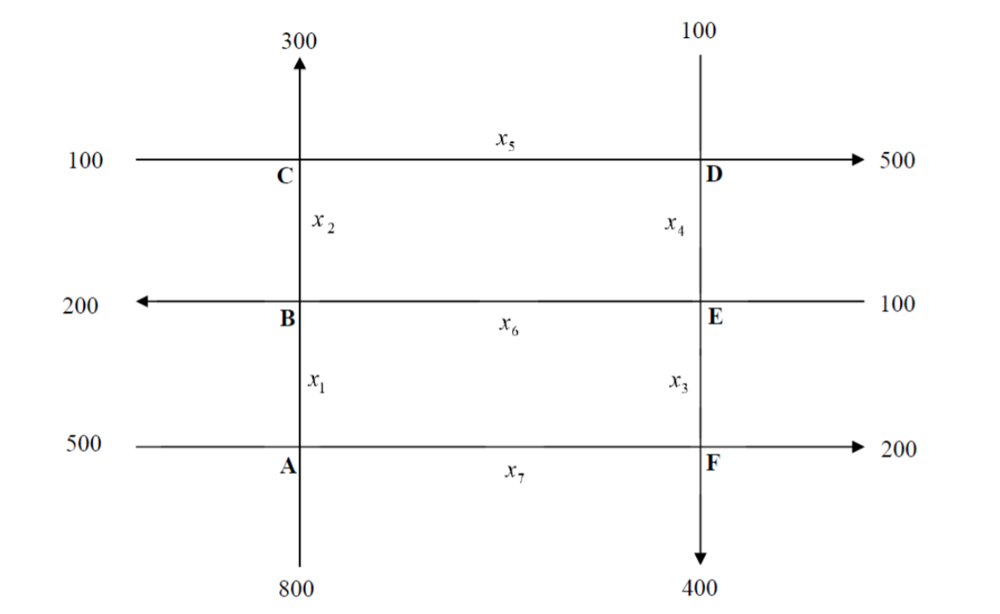

<center></center>

<center><h2><b>Proyecto 01<h2></b></center>

<h4><b>Estudiante:</b> Merian Herrera Fuentes <br></h4>

```{r echo=FALSE, message=FALSE}
library("pracma")
library("mosaic")
library("MASS")
```

<style>
div.blue { background-color:#e6f0ff; border-radius: 5px; padding: 20px;}
</style>

<br>
<div style="background-color:#1D2951;color:white;padding:3px;marging:10px;">
  <h4><b>&nbsp;&nbsp;&nbsp;I Parte: Tienda de Café</b></h4>
</div>
<br>

<div style="text-align: justify;">
<b>
[6 puntos] En una tienda especializada en la preparación de mezclas de café para conocedores, el dueño desea preparar bolsas de un kilogramo para venderlas a $3.5 usando las variedades de café colombiano, brasileño y de Kenia. El costo por kilogramo de cada uno de estos tres tipos de café es respectivamente $4, $2 y $3.
<br>
<br>
</b>
</div>

<b>a) Muestre que se debe usar al menos $\frac{1}{2}$ kg de café colombiano y a lo sumo  y al menos  $\frac{1}{4}$ kg de café brasileño.</b>
<br>

Basado en el enunciado se extrae el siguiente sistema de ecuaciones: <br><br>

<div class = "blue">
&nbsp;&nbsp;&nbsp; **1)** &nbsp; $x$ + $y$ + $z$ = 1 <br>
&nbsp;&nbsp;&nbsp; **2)** &nbsp; 4$x$ + 2$y$ + 3$z$ = 3.5 <br>
</div>

<br>

Cálculo de la matriz escalonada reducida basada en el sistema de ecuaciones anterior:

```{r}
matriz <- matrix(c(
  1, 1, 1, 1,
  4,2,3, 3.5
), nrow = 2, ncol = 4, byrow = TRUE
)

fractions(pracma::rref(matriz))
```
Del cálculo anterior, basados en la matriz reducida extraemos el siguiente sistema de ecuaciones: <br><br>
<div class = "blue">
&nbsp;&nbsp;&nbsp; **1)** &nbsp; $x$ + $\frac{1}{2}$$z$ =$\frac{3}{4}$ <br>
<br>
&nbsp;&nbsp;&nbsp; **2)** &nbsp; $y$ + $\frac{1}{2}$$z$ =$\frac{1}{4}$ <br>
</div>
<br>

<div style="text-align: justify;">
Basandonos en el anterior sistema de ecuaciones, si asumimos que que el valor minimo para $z$ es 0, ya que al ser valores en kilogramos necesitamos tener siempre un valor positivo, de (1) podemos extraer que $x$ =  $\frac{3}{4}$ y de (2) podemos extraer que $y$ =  $\frac{1}{4}$. <br>

Si asumimos que el valor minimo para  $x$ es 0, de (1) podemos extraer que $z$ =  $\frac{3}{2}$, utilizando el valor de $z$ calculado previamente en (2) podemos calcular que el valor de $y$ =  -$\frac{2}{4}$. Al tener un valor negativo en $y$, se puede asumir que $x$ nunca puede ser 0 ya que no debemos tener valores negativos como parte de la solucion a nuestro sistema de ecuaciones. <br>

Cuándo igualamos el valor de $y$ a 0, de (1) extramos que el valor de $z$ =  $\frac{1}{2}$ y utilizando nuestra $z$ calculada previamente en (2) encontramos que el valor de $x$ =  $\frac{1}{2}$. Por lo tanto: <br>

<b>
&nbsp;&nbsp;&nbsp;$\frac{1}{2}$&nbsp;$\le$&nbsp;$x$&nbsp;$\le$&nbsp;$\frac{3}{4}$ <br><br>
&nbsp;&nbsp;&nbsp;$0 \le$&nbsp;$y$&nbsp;$\le$&nbsp;$\frac{1}{4}$ <br><br>
&nbsp;&nbsp;&nbsp;$0 \le$&nbsp;$z$&nbsp;$\le$&nbsp;$\frac{1}{2}$ <br><br>
</b>


> $Conclusión:$ Para formar bolsas de 1kg con el valor de $3.5 la cantidad minima de café colombiano que el dueño debe utilizar es de $\frac{1}{2}$kg y la cantidad máxima es de $\frac{3}{4}$kg. De café brasileño debe utilizar entre 0kg y $\frac{1}{4}$kg y finalmente del café de Kenia la cantidad miníma a utilizar es de 0kg y la cantidad máxima es de $\frac{1}{2}$kg.

</div>
<br>

<b>b) Determine la cantidad de cada tipo de café suponiendo que el dueño decide usar $\frac{1}{8}$ de café brasileño.</b> <br>

Basados en el sistema de ecuaciones calculado para el ejercicio anterior: <br><br>

<div class = "blue">
&nbsp;&nbsp;&nbsp; **1)** &nbsp; $x$ + $\frac{1}{2}$$z$ = $\frac{3}{4}$ <br>
<br>
&nbsp;&nbsp;&nbsp; **2)** &nbsp; $y$ + $\frac{1}{2}$$z$ = $\frac{1}{4}$ <br>
</div>
<br>

Si asumimos que $y$ = $\frac{1}{8}$, de (2) podemos encontrar el valor para $z$ de la siguiente manera: <br>

&nbsp;&nbsp;&nbsp;$\frac{1}{8}$ + $\frac{1}{2}$$z$ = $\frac{1}{4}$ <br> <br>
&nbsp;&nbsp;&nbsp;$\frac{1}{2}$$z$ = $\frac{1}{4}$ - $\frac{1}{8}$ <br> <br>
&nbsp;&nbsp;&nbsp;$\frac{1}{2}$$z$ = $\frac{1}{8}$ <br> <br>
&nbsp;&nbsp;&nbsp;$z$ = $\frac{1}{8}$ / $\frac{1}{2}$ <br> <br>
&nbsp;&nbsp;&nbsp;$z$ = $\frac{1}{4}$ <br> <br>

Teniendo los valores de $z$ y $y$ podemos encontrar el valor de $x$ de la siguiente manera, usando (1) para calcular el valor: <br>

&nbsp;&nbsp;&nbsp;$x$ + $\frac{1}{2}$ * $\frac{1}{4}$ = $\frac{3}{4}$ <br> <br>
&nbsp;&nbsp;&nbsp;$x$ + $\frac{1}{8}$ = $\frac{3}{4}$ <br> <br>
&nbsp;&nbsp;&nbsp;$x$ = $\frac{3}{4}$ - $\frac{1}{8}$ <br> <br>
&nbsp;&nbsp;&nbsp;$x$ = $\frac{5}{8}$ <br> <br>

> $Conclusión:$ Si el vendedor decide usar $\frac{1}{8}$ de café brasileño para crear bolsas de 1kg a $3.5, debe usar $\frac{5}{8}$kg de café colombiano y $\frac{1}{4}$kg del café de kenia.

<br>
<div style="background-color:#1D2951;color:white;padding:3px;marging:10px;">
  <h4><b>&nbsp;&nbsp;&nbsp;II Parte: Fluido de Tránsito</b></h4>
</div>
<br>

<div style="text-align: justify;">
<b>
[10 puntos] Imagine que en un sector determinado de una ciudad, se hizo u estudio sobre el fluido de tránsito de las calles y las avenidas. Supongamos que en un sector de estas vías se pretende realizar reparaciones en el sistema de alcantarillado, por lo que habrá tránsito regulado. En la figura siguiente se muestra el comportamiento de estas vías en las horas pico. Suponiendo que los trabajos de reparación se realizarán en la calle $x_{5}$, entonces los oficiales de tránsito pueden hasta cierto punto, controlar el flujo de vehículos reajustando los semáforos, colocando policías en los cruces claves o cerrando la calle crítica al tránsito de vehículos. Note que si se disminuye el tránsito en $x_{5}$,  aumentará instantáneamente el flujo de tránsito en las otras calles aledañas. Dadas las circunstancias, minimice el tránsito en $x_{5}$ de manera que no ocasione congestionamientos en las otras calles.
</b>
</div>

<center></center>

**Sistema de ecuaciones:**

|   |      Entradas     |      Salidas      |
|---|:-----------------:|:-----------------:|
| a | 500 + 800         | $x_{1}$ + $x_{7}$ |
| b | $x_{1}$ + $x_{6}$ | 200 + $x_{2}$     |
| c | $x_{2}$ + 100     | 300 + $x_{5}$     |
| d | $x_{5}$ + 100     | $x_{4}$ + 500     |
| e | $x_{4}$ + 100     | $x_{6}$ + $x_{3}$ |
| f | $x_{3}$ + $x_{7}$ | 400 + 200         |

<div class = "blue">
**a)** $x_{1}$ + $x_{7}$ = 1300 <br><br>
**b)** $x_{1}$ + $x_{6}$ - $x_{2}$ = 200 <br><br>
**c)** $x_{2}$ - $x_{5}$ = 200 <br><br>
**d)** $x_{5}$ - $x_{4}$ = 400 <br><br>
**e)** $x_{6}$ + $x_{3}$ - $x_{4}$ = 100 <br><br>
**f)** $x_{3}$ + $x_{7}$ = 600 <br>
</div>

```{r}
transito_vial <- matrix(c(
  1, 0, 0, 0, 0, 0, 1, 1300,
  1, -1, 0, 0, 0,1, 0, 200,
  0, 1, 0, 0, -1, 0, 0, 200,
  0, 0, 0, -1, 1, 0, 0, 400,
  0, 0, 1, -1, 0, 1, 0, 100,
  0, 0, 1, 0, 0, 0, 1, 600
), nrow = 6, ncol = 8, byrow = TRUE,
dimnames = list(c("a", "b", "c", "d", "e", "f"), c("X1", "X2", "X3", "X4", "X5", "X6", "X7", "Solucion"))
)

pracma:: rref(transito_vial)

```
<br>

**Sistema de ecuaciones basado en la matriz escalonada reducida:** <br><br>

<div class = "blue">
**1)** $x_{1}$ + $x_{7}$ = 1300 <br><br>
**2)** $x_{2}$ - $x_{6}$ + $x_{7}$ = 1100 <br><br>
**3)** $x_{3}$ + $x_{7}$ = 600 <br><br>
**4)** $x_{4}$ - $x_{6}$ + $x_{7}$ = 500 <br><br>
**5)** $x_{5}$ - $x_{6}$ + $x_{7}$ = 900 <br>
</div>

<br>
<br>

<div style="text-align: justify;">
De (2), (4), (5) se concluye que el valor minimo que puesde tomar -$x_{6}$ + $x_{7}$ para minimizar &nbsp;&nbsp;&nbsp;$x_{5}$ es: <br>
&nbsp;&nbsp;&nbsp;-$x_{6}$ + $x_{7}$ = 500
<br>
&nbsp;&nbsp;&nbsp;$x_{4}$ = 0
<br><br>
Luego  $x_{5}$ = 400  y $x_{2}$ = 600 <br><br>
De (1) podemos concluir que: <br>
&nbsp;&nbsp;&nbsp;$x_{1}$ + $x_{7}$ = 1300 <br>
&nbsp;&nbsp;&nbsp;$x_{1}$ = 1300 - $x_{7}$ <br><br>
Y de (3) se concluye que: <br>
&nbsp;&nbsp;&nbsp;$x_{3}$ + $x_{7}$ = 600 <br>
&nbsp;&nbsp;&nbsp;$x_{3}$ = 600 - $x_{7}$ <br><br>
Además el valor para $x_{7}$ es de 500 + $x_{6}$ ya que: <br>
&nbsp;&nbsp;&nbsp;-$x_{6}$ + $x_{7}$ = 500 <br>
&nbsp;&nbsp;&nbsp;$x_{7}$ = 500 + $x_{6}$ <br>

Por lo tanto el valor minimo para $x_{7}$ = 500 cuando $x_{6}$ = 0 y el valor maximo se obtiene de (3) es decir $x_{7}$ = 600.

<b>
&nbsp;&nbsp;&nbsp;$500 \le$  $x_{7}$ $\le 600$ <br><br>
&nbsp;&nbsp;&nbsp;$0 \le$  $x_{6}$ $\le 100$ <br><br>
&nbsp;&nbsp;&nbsp;$700 \le$  $x_{1}$ $\le 800$ <br><br>
&nbsp;&nbsp;&nbsp;$0 \le$  $x_{3}$ $\le 100$ <br><br>
</b>

> $Conclusión:$ Para minimizar el tránsito en $x_{5}$ es necesario que $x_{7}$ tome un valor minímo de 500 y un valor máximo de 600. Asímismo, $x_{6}$ debe tomar un valor entre 0 y 100, mientras que $x_{1}$ debe pertenecer con valores entre los 700 y 800. Para $x_{3}$ se debe manejar un valor minímo de 0 y un valor máximo de 100.
</div>