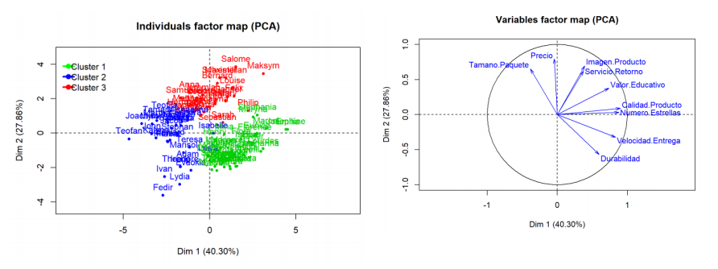
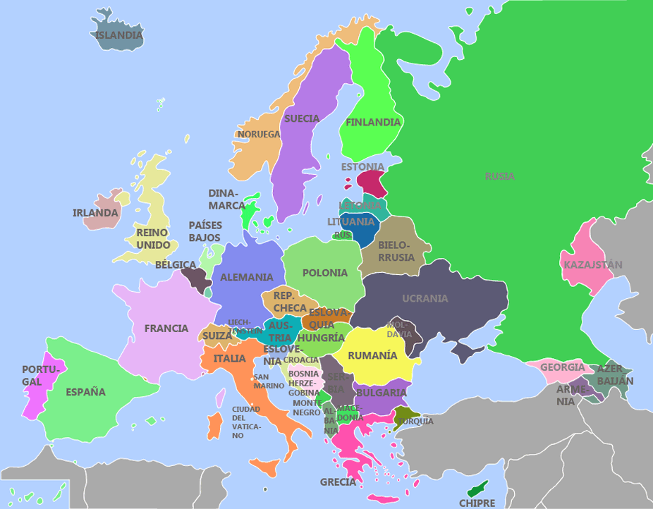

<center></center>

<center><h2><b>Proyecto 02<h2></b></center>

<h4><b>Estudiante:</b> Merian Herrera Fuentes <br></h4>

```{r  message=FALSE}
library("FactoMineR")
library("corrplot")
library("ggcorrplot")
library("corrr")
library("rattle")
library("fmsb")
library("ggmap")
library("mapproj")
library("factoextra")
```


<style>
div.blue { background-color:#e6f0ff; border-radius: 5px; padding: 20px;}
</style>

<br>
<div style="background-color:#1D2951;color:white;padding:3px;marging:10px;">
  <h4><b>&nbsp;&nbsp;&nbsp;I Parte: Algoritmo de recomendación</b></h4>
</div>
<br>

<div style="text-align: justify;">
<b>
1. [20 puntos] Se le pidió a un grupo de 100 clientes que compraron el mismo producto o productos similares en la tienda de AMAZON, que evaluaran el servicio recibido desde diferentes aspectos. El archivo EjemploAlgoritmosRecomendacion.csv muestra los promedios de la evaluación dada por los clientes en relación a las variables que se pueden apreciar en el encabezado de la tabla. Para este dataset, realice lo siguiente:
<br><br>
</b>

<b>
a) Cargue el dataset EjemploAlgoritmosRecomendacion.csv, verifique que la lectura de los datos es correcta. <br>
</b>

```{r}
clientes <- read.csv("EjemploAlgoritmosRecomendacion.csv", sep = ";", dec = ",", header = T,row.names = 1)
head(clientes)
```

<b>
b) A manera de diagnóstico, haga una inspección de los datos presentes en el dataset y describa las variables presentes, tipos de variables, si hay datos nulos. <br>
</b>

```{r}
#str(clientes)
sapply(clientes, typeof)
```

> En el dataset clientes podemos encontrar las siguientes variables: <br>
&nbsp;&nbsp;&nbsp;- Velocidad de Entrega <br>
&nbsp;&nbsp;&nbsp;- Precio <br>
&nbsp;&nbsp;&nbsp;- Durabilidad <br>
&nbsp;&nbsp;&nbsp;- Imagen del producto <br>
&nbsp;&nbsp;&nbsp;- Valor Educativo <br>
&nbsp;&nbsp;&nbsp;- Servicio de Retorno <br>
&nbsp;&nbsp;&nbsp;- Tamaño del paquete <br>
&nbsp;&nbsp;&nbsp;- Calidad del Producto <br>
&nbsp;&nbsp;&nbsp;- Número de estrellas. <br><br>
Las cuales corresponden a valores númericos asignados por los clientes en orden de evaluar los productos comprados en AMAZON. <br>
Todas estas variable son de tipo **cuantitativo** lo que significa que representan valores númericos y admiten operaciones matemáticas sobre ellas. A estas variables cuantitativas las podemos clasificar como **continuas**, es decir, pueden tomar cualquier valor en un intervalo dado. <br>
Se aplicó la función is.na() sobre las columnas del dataset y no se encontrar datos nulos en el dataset clientes.

<b>
c) Determine si existen correlaciones importantes entre las variables del dataset, utilizando alguno de los gráficos o la matriz de correlaciones vistos en clases (si  desea, puede usar otra herramienta de su preferencia). Recordemos que para aplicar un ACP, es importante que existan correlaciones entre las variables. <br>
</b>
<br>
A continuación se muestran las correlaciones numericas para el dataset clientes:
```{r}
# Para ver las correlaciones numéricas
correlaciones_numericas <- round(cor(clientes), 2)
correlaciones_numericas
```

```{r}
corrplot(correlaciones_numericas)
```

```{r}
ggcorrplot(correlaciones_numericas)
```

> Las correlaciones **positivas** más fuertes que se observan son: <br>
&nbsp;&nbsp;&nbsp;- **Imagen del producto**  con **Servicio de Retorno** <br>
&nbsp;&nbsp;&nbsp;- **Número de estrellas** con **valor educativo** <br>
&nbsp;&nbsp;&nbsp;- **Número de estrellas** con **velocidad de entrega** <br>
&nbsp;&nbsp;&nbsp;- **Velocidad de entrega** con **calidad del producto** <br><br>
Las correlaciones **negativas** más fuertes que se observan son: <br>
&nbsp;&nbsp;&nbsp;- **Precio** con **durabilidad** <br>
&nbsp;&nbsp;&nbsp;- **Tamaño del paquete** con **velocidad de entrega** <br>
&nbsp;&nbsp;&nbsp;- **Tamaño del paquete** con **durabilidad** <br>

<b>
d) Realice un ACP usando el paquete FactoMiner, creando el plano principal y el círculo de correlaciones. Superponga ambos gráficos e identifique la cantidad de clústeres que considere apropiado. Haga un análisis descriptivo de cada clúster, indique si hay variables correlacionadas y el tipo de correlación entre estas. <br>
</b>

```{r}
pca_clientes <- PCA(clientes, scale.unit=TRUE, ncp=5, graph = FALSE)
plot(pca_clientes, axes=c(1, 2), choix="ind", col.ind="purple",new.plot=TRUE) 
```

```{r}
plot(pca_clientes, axes=c(1, 2), choix="var", col.var="blue",new.plot=TRUE) 
```

```{r}
fviz_pca_biplot(pca_clientes, repel = FALSE,
                col.var = "#fc078a", # Variables color
                col.ind = "#696969"  # Individuals color
                ) 
```

> Se pueden observar **2 clústeres** bien marcados, cada uno de estos por una correlacion negativa entre el tamaño del paquete y la durabilidad. Podriamos decir que cada grupo de personas representados por un cluster opinaron de manera muy similar en las evaluaciones.<br><br>
**Clúster 01:** En este primer cluster podemos observar al grupo de personas que valora de una manera mas alta el tamano del paquete, de este primer cluster tambien podemos deducir que este grupo de personas valora de una manera positiva variables como el precio, imagen del producto y servicio de retorno. Tambien se observa una correlacion positiva muy fuerte entre la imagen del producto y el servicio de retorno. <br>
**Clúster 02:** En este segundo grupo de  personas podemos encontrar a quienes valoran de una manera mas positiva la durabilidad del producto, estas personas tambien le dan mas importancia a la velocidad de entrega y calidad del producto, Se observa una correlacion positiva fuerte entre calidad del producto y numero de estrellas, lo que nos iindica que a mayor calidad del producto mayor numero de estrellas.<br>

<b>
e) Repita el ejercicio anterior usando el paquete FactoMineR, elimine de los gráficos los individuos con $cos^{2} (\theta)$ $\le 0.2$  y las variables $cos^{2} (\theta)$ $\le 0.55$ y vuelva a crear el plano principal y el círculo de correlaciones. ¿Cuáles individuos quedaron mal representados?, ¿cuáles variables quedaron mal representadas? <br>

Sugerencia: Puede usar el código del documento o cualquiera de su preferencia: <br>
</b>
</div>

<div style="text-align: justify;">
**¿Cuáles individuos quedaron mal representados?**<br>

```{r}
# El coseno cuadrado se calcula sumando los valores de las dos dimensiones por individuo o por variable (puede revisar la presentación, en las diapositivas finales se explica como se calcula este dato

# Se parte del hecho de que ya se tiene el modelo de ACP, que hemos llamado para efectos del ejemplo pca_clientes, de ahí se extrae los cosenos cuadrados de los individuos. Para el caso de las variables, debe cambiar la instrucción pca_datos$ind$cos2 por pca_clientes$var$cos2
cos2.ind<-(pca_clientes$ind$cos2[,1] + pca_clientes$ind$cos2[,2])

individuos_malrepresentados <- NULL

for (i in 1 : nrow(clientes)) {
  ifelse(cos2.ind [i] <= 0.2, individuos_malrepresentados <- rbind(individuos_malrepresentados, i), NA)   
}

cos2.ind[individuos_malrepresentados]

```

```{r}
#plot(pca_clientes, axes=c(1, 2), choix="ind", col.ind="red",new.plot=TRUE, select="cos2 0.2") 
```

```{r}
#res.pca <- prcomp(clientes, scale = TRUE)
fviz_pca_ind(pca_clientes,
             col.ind = "cos2", # Color by the quality of representation
             gradient.cols = c("#00AFBB", "#E7B800", "#fc078a"),
             repel = FALSE     # Avoid text overlapping
             )
```

> Los individuos que están mal representados son:<br>
&nbsp;&nbsp;&nbsp;- Henry <br>
&nbsp;&nbsp;&nbsp;- Isabelle <br>
&nbsp;&nbsp;&nbsp;- Sebastian <br>
Ya que si calculamos el coseno cuadrado de sus coeficientes de relación todos los resultados son menores a 0.2

**¿Cuáles variables quedaron mal representadas?**

```{r}
cos2.var<-(pca_clientes$var$cos2[,1] + pca_clientes$var$cos2[,2])

variables_malrepresentadas <- NULL
for (i in 1 : ncol(clientes)) {
  header <- names(cos2.var[i])[1]
  value <- cos2.ind[i]
 ifelse(value <= 0.55, variables_malrepresentadas <- cbind(matrix(c(header, value), 2, 1, TRUE), variables_malrepresentadas), NA)
}
variables_malrepresentadas
```

```{r}
# plot(pca_clientes, axes=c(1, 2), choix="var", col.var="blue",new.plot=TRUE, select="cos2 0.55") 
```

```{r}
fviz_pca_var(pca_clientes,
             col.var = "cos2", # Color by contributions to the PC
             gradient.cols = c("#00AFBB", "#E7B800", "#fc078a"),
             repel = TRUE     # Avoid text overlapping
             )
```

> La única variable mal representada en los datos anteriores es **Servicio.Retorno** ya que el cálculo de el coseno cuadrado de su coeficiente de relación es menor a 0.55, como se puede observar en el gráfico anterior.


</div>

<div style="text-align: justify;">
<b>
f) Realice un gráfico radar (araña) usando 3 clústeres e interprete cada uno de los clústeres. <br>
</b>

```{r}
modelo <- hclust(dist(clientes),method= "ward")
```
```{r}
centros<-centers.hclust(clientes,modelo,nclust=3,use.median=FALSE)
centros
```

```{r}
rownames(centros)<-c("Cluster 1","Cluster 2","Cluster 3")
centros<-as.data.frame(centros)
maximos<-apply(centros,2,max)
minimos<-apply(centros,2,min)
centros<-rbind(minimos,centros)
centros<-rbind(maximos,centros)
centros
```

```{r}
radarchart(centros,maxmin=TRUE,axistype=4,axislabcol="slategray4",
           centerzero=FALSE,seg=8,cglcol="gray67",
           pcol=c("#00AFBB", "#E7B800", "#fc078a"),
           plty=1,
           plwd=5,
           title="Comparacion de clusteres")

legenda <-legend(1.5,1, legend=c("Cluster 1","Cluster 2","Cluster 3"),
                 seg.len=-1.4,
                 title="Clusteres",
                 pch=21, 
                 bty="n" ,lwd=3, y.intersp=1, horiz=FALSE,
                 col=c("#00AFBB", "#E7B800", "#fc078a"))
```

> Cluster 1: <br>
Cluster 2: <br>
Cluster 3: <br>

<b>
g) Suponga que se trabajaron los datos con 3 clústeres, como se muestra en el plano principal siguiente: <br>

<center></center>

<br>
Partiendo del hecho de que todos los individuos compraron, ya sea el mismo producto o similares, pero, cada uno tuvo una experiencia de compra diferente que pudo ser mejor o peor en los diferentes rubros de la evaluación, <br>

• ¿Qué productos recomendaría a Salome?<br>
</b>

> Salome se encuentra representado en el cluster 3, donde tambien se encuentran representados otros individuos que le dan mayor valor a las mismas variables que Salome, por lo tanto, se recomienda a Salome comprar los mismos productos adquiridos por personas dentro de este cluster como: Maksym, Louise, Philip...

<b>
• ¿Qué productos recomendaría a Stephania?<br>
</b>

> A Stephania la vemos representada en el cluster 1, donde tambien vemos representados a individuos como Maryna, Eunice y Marcel Se recomienda a Stephania adquirir productos que han comprado algunos de los individuos mencionados previamente o productos adquiridos por cualquiera de los individuos representados en el cluster 1.

<b>
• ¿Qué productos recomendaría a Lydia?<br>
</b>

> Lydia por su parte esta representada dentro del cluster 2, dentro de este cluster tambien vemos representados a Ivan, Fedir, Evdokia... Al igual que los individuos representados en los clusters 1 y 3, se recomienda a Lydia comprar productos que han sido adquiridos por los individuos representados en el cluster que la representa, en este caso el cluster 2.

<b>
Es decir, los mismos productos que compró cuál otro cliente.
</b>
</div>


<div style="background-color:#1D2951;color:white;padding:3px;marging:10px;">
  <h4><b>&nbsp;&nbsp;&nbsp;II PARTE: resuelva la siguiente situación</b></h4>
</div>
<br>

<div style="text-align: justify;">
<b>
1. [10 puntos] Considérese tabla datos ConsumoEuropa.csv que contiene una estimación del consumo promedio de proteínas, en gramos, por persona y por día, en Europa, datos del año 1981 (Está en el aula virtual con el nombre). <br><br>
</b>

```{r}
consumo <- read.csv("ConsumoEuropa.csv", sep = ";", dec = ",", header = T,row.names = 1)
head(consumo)
```

<b>
a. Usando FactoMineR efectúe un ACP para esta tabla de datos.<br>
</b>
```{r}
pca_consumo <- PCA(consumo, scale.unit=TRUE, ncp=5, graph = FALSE)
```


<b>
b. Grafique el plano principal y el círculo de correlaciones, luego compare este Plano Principal con el mapa de Europa ¿Qué conclusiones puede sacar?<br><br>

Considere que podría recortar alguno de estos gráficos, hacer rotaciones y es necesario buscar un mapa de Europa, de preferencia un mapa político.

</b>

```{r}
plot(pca_consumo, axes=c(1, 2), choix="ind", col.ind="#00AFBB",new.plot=TRUE)
```

```{r}
plot(pca_consumo, axes=c(1, 2), choix="var", col.var="#fc078a",new.plot=TRUE) 
```

<center></center>

</div>